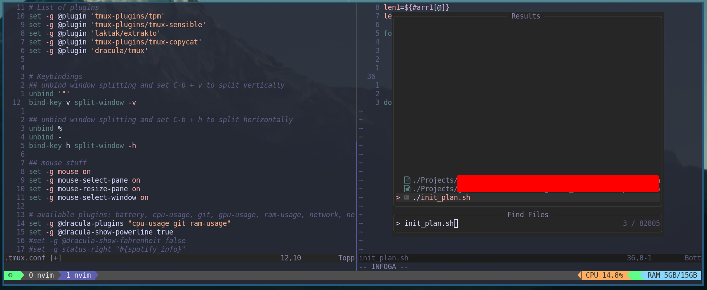

# My tmux-config

It took some time, but I finally started setting up tmux.

## Plugins

I'm using TPM to install & setup all the plugins, defined as such:

```bash
set -g @plugin 'tmux-plugins/tpm'
set -g @plugin 'tmux-plugins/tmux-sensible'
set -g @plugin 'laktak/extrakto'
set -g @plugin 'tmux-plugins/tmux-copycat'
set -g @plugin 'dracula/tmux'

```
## Plugin manager

Project [tpm](https://github.com/tmux-plugins/tpm)

Install tpm by following their setup.

Just run 'C-b + I' to install all the plugins.

## Looks



## Can I modify it?

Absolutely!
